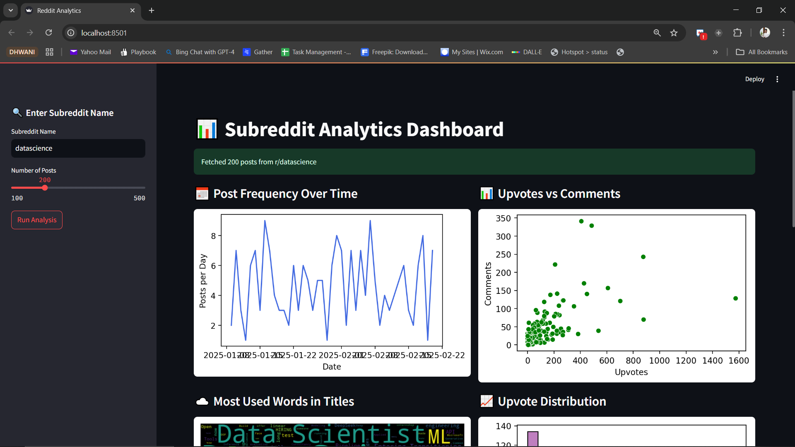

# Reddit Analytics Streamlit App

## 📌 Overview
This Streamlit app allows users to analyze Reddit subreddit data by fetching posts and visualizing key metrics using various charts. Users can enter a subreddit name, select the number of posts to fetch, and generate analytics with a single click.

## 🛠 Features
- **Fetch Hot Posts**: Retrieve up to 500 posts from any subreddit.
- **Post Frequency Analysis**: View the daily posting trends.
- **Upvotes vs. Comments**: Scatter plot analysis of post engagement.
- **Word Cloud**: Visualize the most common words in post titles.
- **Upvote & Comment Distributions**: Histograms to analyze engagement metrics.
- **Top Authors**: Identify the most active users in the subreddit.

## 🖥 UI Preview


## 🚀 Installation
1. Clone the repository:
   ```sh
   git clone  https://github.com/ganeshmalasani/reddit-analytics.git
   cd reddit-analytics
   ```
2. Install dependencies:
   ```sh
   pip install -r requirements.txt
   ```
3. Run the app:
   ```sh
   streamlit run app.py
   ```

## 🔑 Setup Reddit API Credentials
Replace `your_client_id`, `your_client_secret`, and `your_user_agent` in `app.py` with your Reddit API credentials.

## 📝 Requirements
- Python 3.x
- Streamlit
- PRAW (Python Reddit API Wrapper)
- Pandas
- Matplotlib
- Seaborn
- WordCloud

## 🤝 Contributing
Feel free to fork the repository and submit pull requests for improvements.

## 📜 License
This project is licensed under the MIT License.

